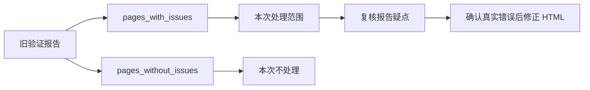
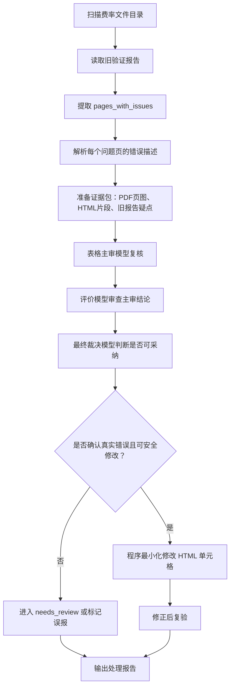
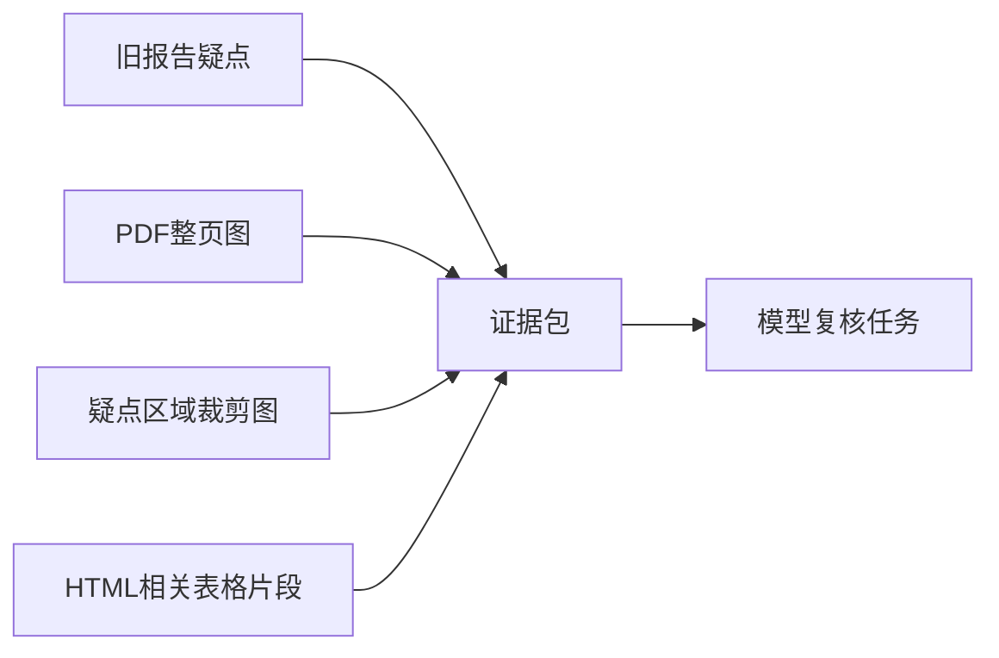
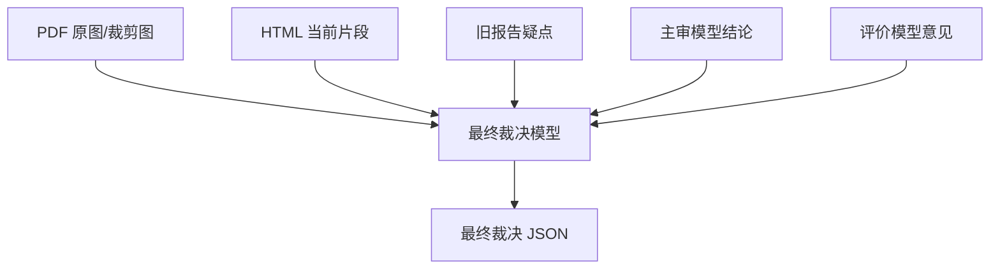
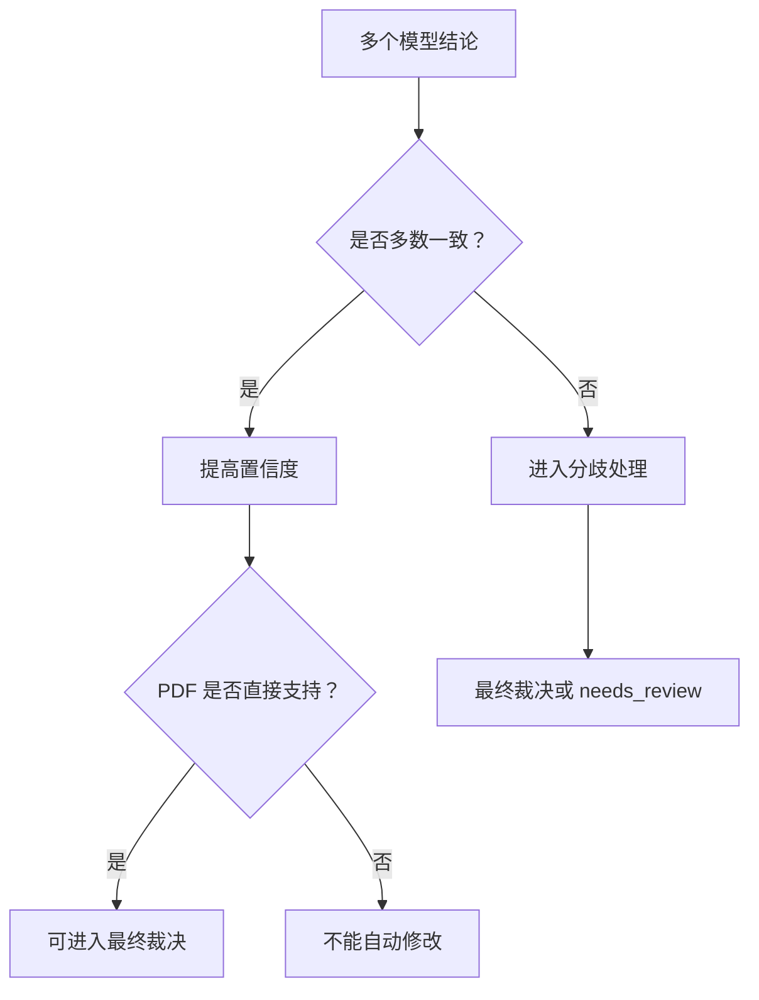
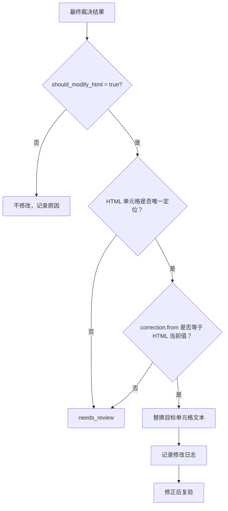
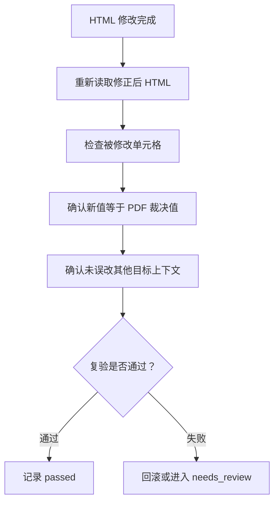

# 错误页定向复核与 HTML 修正技术方案

## 1. 背景与目标

当前目录 `第一批采集结果（源于重疾险1.zip）` 中存放了一批由大模型从 PDF 费率表抽取生成的 HTML 表格结果，并已生成旧版大模型验证报告。

本次任务目标：

- 只针对旧验证报告标记为错误的页面进行复核。
- 判断旧报告指出的问题是真错还是误报。
- 对确认真实错误的 HTML 单元格进行修正。
- 输出修正后的 HTML 文件、修正日志、复核证据和待人工确认清单。

核心原则：

> PDF 是唯一真值；旧验证报告只是线索；模型结论不能直接替代 PDF 证据。

---

## 2. 范围调整

本方案不再做所有通过页的全量复查，而是只处理旧报告中的问题页。



范围口径：

- 本方案覆盖旧报告标记的问题页。
- 本方案不承诺覆盖旧报告认为通过的页面。
- 如果某个问题页存在连续错位或整列错位，可在该问题页内扩展检查范围。
- 不跨页扩展到旧报告未标记的问题之外。

---

## 3. 模型分层策略

本方案不是简单选择最便宜模型做初筛，而是选择一个**相对便宜但表格识别能力足够强**的模型作为第一轮主审。

模型分层如下：

| 层级 | 角色 | 推荐模型 | 作用 |
|---|---|---|---|
| 第一层 | 表格主审模型 | `abab6.5-chat` 或 `qwen3-vl-235b-a22b-instruct` | 读取 PDF 和 HTML，判断旧报告疑点是否真实 |
| 第二层 | 评价模型 | `qwen3-vl-235b-a22b-instruct` 或 `gemini-2.5-flash` | 审查主审模型结论是否可靠 |
| 第三层 | 最终裁决模型 | `claude-sonnet-4-6` | 对候选修正做最终证据审查 |

说明：

- 本报告按 `abab6.5-chat` 具备视觉能力设计。
- 第一层模型应通过小样本测试确定，不能只按价格选择。
- `claude-sonnet-4-6` 成本较高，不用于大范围初筛，只用于最终裁决。

---

## 4. 总体流程



---

## 5. 证据包设计

每个疑点任务都应构造一个尽量小而完整的证据包。



证据包包含：

| 材料 | 作用 |
|---|---|
| PDF 整页高清图 | 提供完整页面上下文 |
| PDF 疑点区域裁剪图 | 提高数字读取准确率 |
| HTML 对应表格片段 | 提供当前抽取结果 |
| 旧报告错误描述 | 作为线索，帮助定位疑点 |
| 相邻行/列上下文 | 防止行列定位错误 |

旧报告只用于定位，不作为最终答案。

---

## 6. 第一层：表格主审模型

主审模型负责第一次实质性判断。

输入：

- PDF 页图。
- 疑点区域裁剪图。
- HTML 对应片段。
- 旧报告疑点。

输出 JSON：

```json
{
  "page": 8,
  "is_real_error": true,
  "target_location": {
    "row_context": "21",
    "column_context": "第6列"
  },
  "html_value": "94.82",
  "pdf_value": "87.18",
  "correction": {
    "from": "94.82",
    "to": "87.18"
  },
  "confidence": "high",
  "reason": "PDF 对应单元格可直接读为 87.18"
}
```

主审模型要求：

- 必须直接读取 PDF 图像。
- 不允许根据上下行递增规律推断。
- 不允许直接相信旧报告。
- 看不清必须返回 `uncertain`。
- 如果发现是连续错位，应明确列出连续受影响单元格。

---

## 7. 第二层：评价模型

评价模型不重新做完整抽取，而是审查主审模型是否可靠。

输入：

- 同一证据包。
- 主审模型输出。

评价重点：

- 主审模型是否读错 PDF。
- 主审模型是否错行、错列、错表。
- 候选修正值是否能从 PDF 直接确认。
- 是否存在连续错位但主审只修了单点。
- 是否有必要进入最终裁决。

输出 JSON：

```json
{
  "primary_result_supported": true,
  "candidate_pdf_value": "87.18",
  "location_supported": true,
  "concerns": [],
  "recommendation": "send_to_final_judge"
}
```

---

## 8. 第三层：最终裁决模型

最终裁决模型负责判断候选结论能否用于修改 HTML。

它不是简单看模型投票，而是检查证据链。

### 8.1 裁决输入



裁决模型的证据权重：

```text
PDF 图像证据 > HTML 当前值 > 主审模型结论 > 评价模型意见 > 旧报告线索
```

### 8.2 裁决输出

```json
{
  "final_decision": "modify",
  "is_real_error": true,
  "pdf_value_confirmed": "87.18",
  "html_value_confirmed": "94.82",
  "target_location_confirmed": true,
  "correction": {
    "from": "94.82",
    "to": "87.18"
  },
  "confidence": "high",
  "basis": {
    "pdf_directly_readable": true,
    "html_value_matches_current_cell": true,
    "primary_model_supported": true,
    "review_model_supported": true
  },
  "should_modify_html": true
}
```

如果证据不足：

```json
{
  "final_decision": "needs_review",
  "is_real_error": null,
  "pdf_value_confirmed": null,
  "html_value_confirmed": "94.82",
  "target_location_confirmed": true,
  "confidence": "low",
  "basis": {
    "pdf_directly_readable": false
  },
  "should_modify_html": false,
  "reason": "PDF 局部图中目标单元格不清晰，不能直接确认修正值"
}
```

---

## 9. 为什么不能只靠投票

投票可以作为辅助信号，但不能作为最终自动修改依据。



不能只靠投票的原因：

- 多个模型可能被同一份旧报告带偏。
- 模型可能都认为“有问题”，但给出的正确值不同。
- 表格错误常见于行列错位，不是简单单点错误。
- 多数票不能证明候选值一定来自 PDF 目标单元格。
- 模型错误并非独立随机错误，容易共同看错相似数字。
- 看不清时多个模型可能根据规律猜出同一个值。

因此，最终自动修改必须满足：

```text
多模型结论支持 + PDF 直接可读 + 行列定位明确 + HTML 单元格唯一定位
```

---

## 10. 自动修正规则



自动修改必须同时满足：

- 裁决模型确认 `should_modify_html = true`。
- PDF 值可直接从图像读取。
- 行列位置确认无歧义。
- HTML 当前值与 `correction.from` 一致。
- 程序能唯一定位目标单元格。
- 修改只影响目标单元格文本，不改变 HTML 结构。

以下情况不自动修改：

- PDF 看不清。
- 模型结论冲突且裁决不明确。
- HTML 无法唯一定位。
- 旧报告说法与 PDF 证据冲突。
- 疑似整页结构错乱，无法单点修正。

---

## 11. HTML 修改方式

不让模型直接重写 HTML。

程序负责最小化修改：


修改日志示例：

```json
{
  "file": "xxx_费率文件.html",
  "page": 8,
  "row_context": "21",
  "column_context": "第6列",
  "old_value": "94.82",
  "new_value": "87.18",
  "decision": "auto_corrected",
  "primary_model": "qwen3-vl-235b-a22b-instruct",
  "review_model": "gemini-2.5-flash",
  "final_judge": "claude-sonnet-4-6"
}
```

---

## 12. 修正后复验

修正后只对被修改页面和被处理疑点复验。



复验内容：

- 修改后的值是否等于裁决确认的 PDF 值。
- 目标行列是否仍然正确。
- 是否只改了目标单元格。
- 旧报告中的该疑点是否已有明确状态。

---

## 13. 输出结果

建议输出目录：

```text
output/
  corrected_html/
    xxx_费率文件.html

  reports/
    correction_report.json
    correction_report.csv
    needs_review.json
    false_positive_report.json

  evidence/
    rendered_pages/
    cropped_regions/
    model_responses/
```

文件说明：

| 文件/目录 | 内容 |
|---|---|
| `corrected_html/` | 修正后的 HTML |
| `correction_report.json` | 自动修正明细 |
| `correction_report.csv` | 便于人工查看的修正清单 |
| `needs_review.json` | 无法自动确认的问题 |
| `false_positive_report.json` | 旧报告误报清单 |
| `evidence/` | PDF 图片、裁剪图、模型响应 |

---

## 14. 推荐实施步骤


### 阶段一：小样本评估

从旧报告问题页中挑选代表样本：

- 单个数字错误。
- 连续行错位。
- 两个旧模型结论冲突。
- 数字密集、易混淆页面。

比较 `abab6.5-chat`、`qwen3-vl-235b-a22b-instruct`、`gemini-2.5-flash` 在表格复核上的表现，确定第一层表格主审模型。

### 阶段二：错误页定向复核

只处理 `pages_with_issues`，生成疑点任务和模型结论。

### 阶段三：自动修正

只修正最终裁决确认、且 HTML 可唯一定位的单元格。

### 阶段四：复验和交付

输出修正后 HTML、修正报告、误报报告和待人工确认清单。

---

## 15. 结论

新版方案采用低成本定向复核：

> 只处理旧报告错误页；用表格能力强且成本可控的模型做主审；用评价模型审查；用最强模型最终裁决；程序只做最小化 HTML 修改。

该方案相比全量复核节省时间和费用，同时通过最终裁决和 PDF 证据约束，降低错误修正风险。

最终自动修改不依赖简单投票，而依赖：

- PDF 直接证据；
- 行列定位确认；
- 主审与评价模型的结构化意见；
- 最强模型最终裁决；
- 程序对 HTML 单元格的唯一定位。

